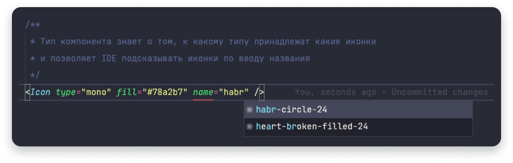
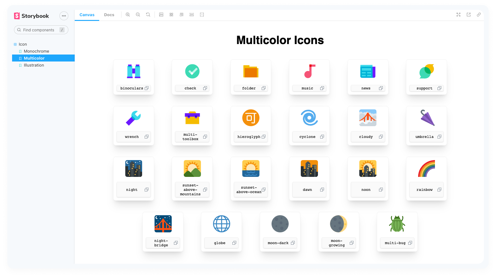
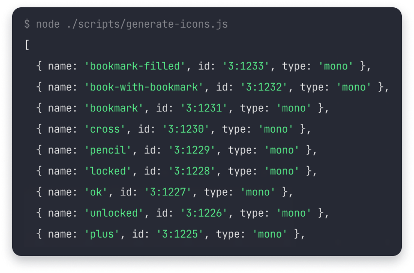
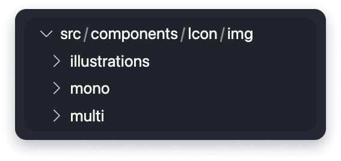
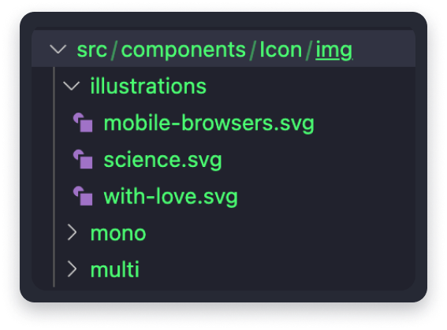
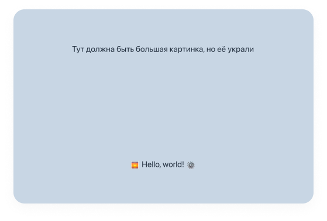
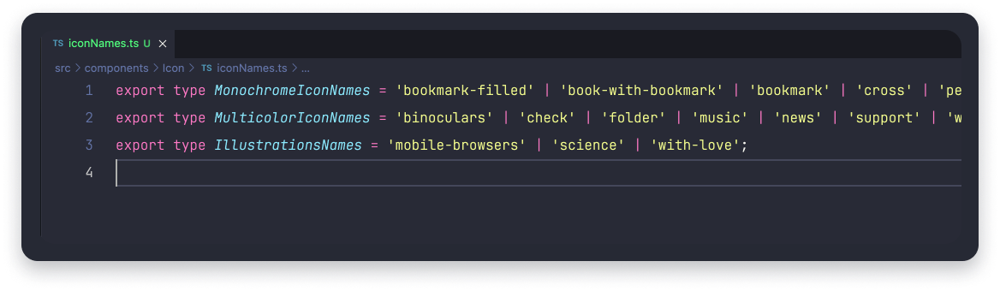
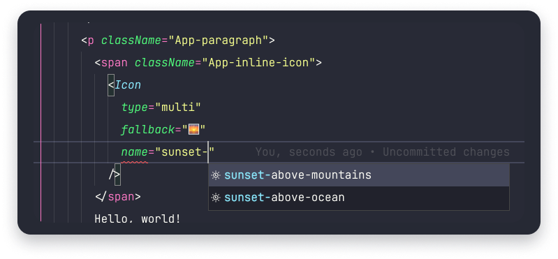
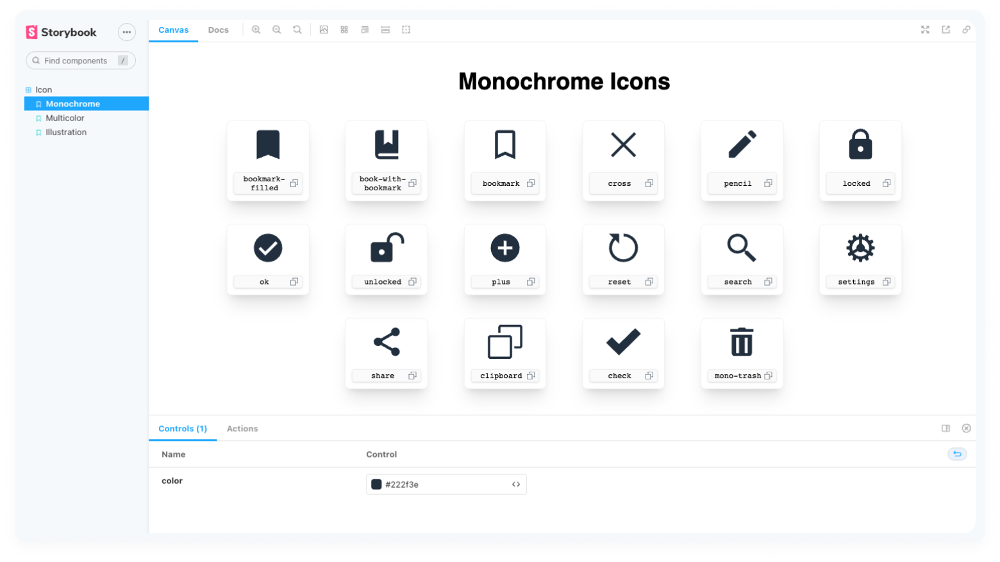
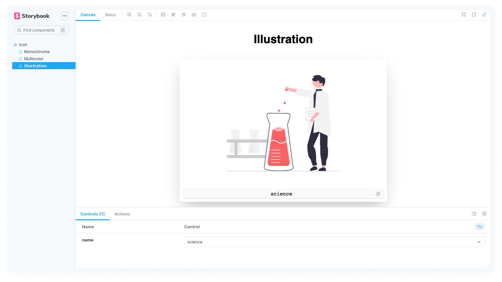

# Выгрузка иконок из Figma

---

| Repo                                          | Figma                                                                       |
|:--------------------------------------------- | --------------------------------------------------------------------------- |
| https://github.com/vbifonixor/icon-extractor/ | https://www.figma.com/file/yYOcOaqdNOd40vLvc29Dws/Sample-Icon-Pack?node-id=0%3A1 |

---

# Введение

В [более-менее сложном](https://www.gnu.org/philosophy/javascript-trap.html) клиентском веб-приложении рано или поздно возникают проблемы с переиспользованием визуальных элементов, решать которые призвана добрая часть гаджетов на поясе инструментов современного фронтенд-ремесленника.

Тем не менее, developer experience во фронтенде всё ещё довольно далёк от пика своего совершенства, и разные команды по-разному стараются решить свои проблемы в этом направлении.

Мы в Joom решили начать с малого и автоматизировали выгрузку и систематизацию иконок нашего интерфейса. В этой статье я хочу рассказать о том, почему в нашем проекте работа с иконками вообще была проблемой, как именно мы её решили и почему эта задача вовсе не так страшна, как казалась нам на первый взгляд.

## Как и почему мы жили без управления иконками?

Иконки — это привычный элемент интерфейса, который позволяет пользователю визуально ориентироваться, ассоциативно давая понять, на что он может рассчитывать, когда взаимодействует с элементом интерфейса, помеченным этой иконкой.

Иконки в графических интерфейсах существуют с самого появления таковых, и разработка веб-интерфейсов, разумеется, не обошла их стороной.

Но в экскурс по истории пиктограмм мы пускаться не будем, вместо этого я вкратце опишу ситуацию с иконками в нашем проекте до того, как мы решили пересмотреть наш подход в сторону описанного в этой статье.

### Как обстояли дела с концептуальной точки зрения

Итак, в нашем проекте одновременно сосуществуют разные виды иконок:


Логически их можно было сгруппировать по требованиям (это группирование пригодится нам чуть позже):

- **Одноцветные** иконки — всегда одноцветные. В интерфейсе допустимо их перекрашивать в любой цвет в зависимости от контекста, можно менять их размер в зависимости от необходимости. Они всегда вписываются в квадратную область.
- **Многоцветные** иконки имеют те же свойства, что и одноцветные, но их перекрасить нельзя
- **Иллюстрации** — это большие векторные изображения, которые вписываются в прямоугольную область и в случае необходимости изменения их размера всегда сохраняют соотношение сторон независимо от размерностей (в css это достигается с помощью `object-fit: contain`).

Все иконки, разумеется, используются в векторном формате.

### Как обстояли дела с точки зрения подключения и сборки

Наш веб-интерфейс построен на [React](https://reactjs.org/) с использованием [TypeScript](https://www.typescriptlang.org/) и с [Webpack](https://webpack.js.org/) в качестве сборщика.

Примерно таким образом иконки уживались в нашем проекте:

- `.inline.svg` преобразовывались хитрым хелпером в base64 и вставлялись в таком виде в CSS с возможностью докидывать атрибуты иконке с помощью черной магии (*уже чувствуется некое недоброе ощущение от этих строк, да?*).
- `.jsx.svg` проходили обработку через [`@svgr/webpack`](https://react-svgr.com/docs/webpack/) и позволяли вставлять себя в качестве компонентов в jsx-дерево (по сути вшиваясь в итоговый html).
- `.svg` подгружались с помощью [`url-loader`](https://v4.webpack.js.org/loaders/url-loader/) и выгружались в CDN, как и полагается статическим файлам.

Такая, мягко говоря, необычная система возникла вследствие обыкновенной энтропии, которая со временем нарастает в каждом проекте (и начинает это делать в таких небольших, уютных и тёмных местах, куда редко кто-либо заглядывает).

### Как обстояли дела с точки зрения структуры проекта

Строгого регламента о встраивании иконок у нас не было (вероятно, тоже просто потому, что никто не придавал этому большого значения — всё работает и разработчика ничего не ограничивает выбирать удобный способ самостоятельно).

Тем не менее, какие-то попытки структурировать иконки всё же предпринимались.

Один из подходов, который применялся очень давно - папка `icons` рядом с общими основными стилями, которые у нас называются `theme` — что-то подобное токенам дизайн-системы, но без явного тому обозначения  — сборник переменных для цветов, сетки, миксины `clearfix`'ов, основных брейкпоинтов для медиазапросов. Сюда же попали и svg-иконки, которые имели формат `.svg`. Иконки эти не кастомизировались никак и иногда имели дубликаты с дополнительными суффиксами вроде  `.white.svg` и `.inverse.svg` для разных значений `fill`.

Другой существующий в проекте подход — папка с иконками-компонентами `/components/Icons`, в которую иконки складывались то в формате `.jsx.svg`, то оборачивались в собственные полноценные компоненты с дополнительной логикой (например, с темизацией и собственными стилями).

Третий подход куда более анархический — складывание иконок в папке `img` внутри папки компонента, в котором они используются. В любом из доступных форматов, которым с точки зрения разработчика, пишущего компонент, удобнее его использовать.

Наконец, иллюстрации существовали в своем мире — для них была отдельная папка в `/components`, в которой лежало несколько svg-файлов, `index.js` и файл со стилями. Из `index.js` экспортируется  компонент, который рендерит тег `img`, добавляет к нему `className` и позволяет передать туда `src`. И несколько компонентов-пресетов для большинства иллюстраций в папке с заранее установленным `src`.

Можно охарактеризовать такое головокружительное разнообразие как гибкий подход, однако у него есть некоторые проблемы.

- Часто довольно сложно найти и использовать уже имеющуюся в проекте иконку или иллюстрацию, ведь очень трудно собрать не то чтобы витрину, а даже просто список всего имеющегося в проекте, потому что пришлось бы обойти **обе** общие папки и кучу компонентов, чтобы найти нужную иконку.
- Некоторые использованные подходы вынуждают плодить сущности. В случае с первым из описанных — это дополнительные копии одной и той же иконки, отличающиеся только значением `fill`, в случае с третьим — иконку из папки компонента надо думать, как и куда выносить за его пределы для использования внутри другого компонента, причем так, чтобы не сломать поведение того модуля, где иконка лежала изначально. И при этом она может быть не в самом удобном для использования в новом месте формате (например тоже заранее покрашена с помощью `fill` и упакована в `.svg` для загрузки в качестве обычного статичного изображения. Это раздувает кодовую базу проекта, замедляет сборку, потенциально увеличивает время загрузки страниц (в зависимости от способа подключения)
- Каждый способ имеет свой набор проблем, которые решает, и свой набор недостатков, что заставляет разработчика каждый раз взвешивать свой выбор. Или, ещё проще, выбирать самый удобный, даже не оглядываясь на его недостатки, ведь ещё одна соломинка в стоге вряд ли сломит верблюду горб.
- Эта же дилемма вместе с разными личными предпочтениями разработчиков в отсутствие жесткого закрепления в кодстайле приводит к спорам на код-ревью, которые тратят время уже минимум двух разработчиков.

В результате таких споров и возникла идея о том, что стоит подумать о разрешении этих проблем.


**[https://xkcd.com/927/](https://xkcd.com/927)**

Решение, которое нас устроило бы, должно было включать в себя:

- один компонент для подключения всех видов иконок,
- удобную витрину для поиска существующих иконок,
- договоренность с дизайнерами придерживаться одинакового нейминга иконок как в макетах, так и в приложении,
- признание единственным источником правды макетов дизайн-системы, синхронизацию которых с кодовой базой следует автоматизировать

Главный принцип, который должен соблюдаться в решении — разработчик не задумывается ни о каких деталях, если ему нужно подключить иконку.

Теперь, когда мы знаем, какие проблемы пытаемся решить и что хотим получить, мы готовы приступить к готовке такого решения.

# Рецепт

Мы будем готовить комплексный обед из трёх блюд:

- **Компонент `<Icon />`**, которым можно будет пользоваться для каждого вида иконок. Обладает необходимыми возможностями кастомизации, ленивой загрузкой иконок, типизацией, и задаст нужные стили по-умолчанию каждому виду иконок в соответствии с требованиями к ним.

    


- **Скрипт для автоматической выгрузки иконок из Figma**. Такое приспособление поможет избежать ошибок, связанных с человеческим фактором, и даст необходимые для соблюдения порядка и структуры ограничения как разработчикам, так и дизайнерам.

    .png)


- **Удобная витрина для поиска иконок**. Послужит и документацией, и средством быстрого поиска существующих иконок, и визуальным "десертом" для всех заинтересованных в порядке среди иконок людей.

    


Нам понадобится:

- **React.js**
- Рабочий аккаунт **Figma** для получения токена и походов в API за иконками
- **Node.js** для сохранения иконок из Figma в файловой системе пользователя
- Щепотка **TypeScript** по вкусу
- **Несколько рабочих дней** одного разработчика для написания кода и обсуждения требований к иконкам с дизайнерами

> ✏️**Есть и другие подходы и обсуждения той же проблемы.**
>
> Например, коллеги из red_mad_robot написали [крутую статью](https://github.com/RedMadRobot/figma-export) о похожем решении на Swift для iOS и Android-проектов. А еще, коллеги из разных крупных компаний пишут массивные инструменты вроде [Theo](https://github.com/salesforce-ux/theo) и [Style Dictionary](https://amzn.github.io/style-dictionary) для управления своими кросс-платформенными библиотеками токенов дизайн-систем.
>
> Эта тема, однако, находится за пределами рассматриваемой в этой статье проблемы.

## Готовим иконки к выгрузке

Начнем с самих иконок. Чтобы приступить к их выгрузке, надо подготовить для этого почву — договориться с дизайнерами о требованиях к ним.

У нас есть документик, который содержит вот такие требования (немного адаптировал его для статьи):

> Для правильной выгрузки из [макета с иконками в фигме](https://www.figma.com/file/aym1EyRNJg7lHPtoJo4Pr2), иконки должны соблюдать следующие правила:
>
> - Названия иконок должны писаться без заглавных букв. Вместо пробела для разделения слов следует использовать дефис. Плохой пример: `Joom Logo`. Хороший пример: `joom-logo`.
> - Фреймы с иконками (либо непосредственно компонент, либо его родитель. Приоритет у компонента, т. е. компонент иконки `mono-info` лежащий внутри фрейма-контейнера `multi-service` должен парситься как монохромный) должны быть с префиксами, чтобы определять их тип. Для монохромных иконок - это `mono-`, для многоцветных это `multi-`, для иллюстраций - `illustration-`
> - Основной цвет монохромной иконки (для корректной замены на нужный) должен быть `#2D2F43`
> - Названия иконок не должны повторяться как минимум в рамках одного типа
> - Заглушки (шаблоны, заготовки) для иконок следует пометить префиксом `stub-`, тогда они будут игнорироваться
> - Фрейм, представляющий непосредственно иконку, должен быть обозначен как компонент
> - Компоненты должны быть опубликованы в библиотеке$^1$
> - Компоненты должны находиться на глубине одного родительского фрейма-контейнера в документе$^2$
> - В фреймах-контейнерах нельзя хранить что-либо кроме иконок$^2$
>
> ---
>
> $^1$ только если у вас оплачена подписка для “профессиональной команды”, см. пояснение ниже
>
> $^2$ только если у вас нет такой подписки
>

Нашим дизайнерам не составило труда подогнать существующий файл в фигме под эти правила.

Я подготовил специальный файлик, который удовлетворяет всем этим требованиям, и на котором мы можем попрактиковаться в выгрузке до всяких походов к дизайнерам в целях удобства читателя. Найти и скопировать его к себе вы можете [по ссылке](https://www.figma.com/file/yYOcOaqdNOd40vLvc29Dws/Sample-Icon-Pack).


>⚠️ Публикация компонентов в библиотеке доступна только для **профессиональных команд** внутри фигмы. У фигмы есть несколько статей, описывающих как работают командные механики и чем они могут быть полезны:
>
> - О том, как завести в фигме команду и зачем это может быть нужно, написано [здесь](https://www.figma.com/best-practices/team-file-organization/).
> - О том, как дизайнеру работать с компонентами, они рассказали [здесь](https://help.figma.com/hc/en-us/articles/360038662654-Guide-to-Components-in-Figma).
> - О том, как (и зачем) публиковать свои компоненты они пишут [здесь](https://help.figma.com/hc/en-us/articles/360025508373-Publish-styles-and-components).
>
>Дальше при разработке утилиты для выгрузки я буду считать, что никакой профессиональной команды у нас нет, и что компоненты ни в какие командные библиотеки не публикуются — это добавит нам немного препятствий на пути к цели (конкретно о них я расскажу в отдельном примечании), но увеличит количество людей, которым эта статья может стать полезной, поскольку не во всех случаях у читателей может быть возможность или желание оплатить подписку.


Для тех, кому лень ходить по ссылке, наш тренировочный набор иконок выглядит как-то так:

.png)

У нас есть три страницы, на первой просто иконки: на одном фрейме одноцветные, на другом — разноцветные, все вписаны в квадрат. На второй странице — эмодзи из опенсорсного набора [twemoji](https://twemoji.twitter.com/), на третьей — тоже опенсорсные иллюстрации с cайта [undraw.co](https://undraw.co/illustrations)

Все иконки и иллюстрации находятся на уровне не дальше второго в дереве фреймов (будем считать, что фоновые родительские фреймы с белой заливкой группируют иконки по типу на каждой странице), основной цвет одноцветных иконок заменен на указанный выше, именование через дефис, названия фреймов (родительских) с нужными префиксами, названия иконок не повторяются, заглушка с правильными размерностями для иллюстраций помечена как `stub-`. Другими словами, у нас всё действительно согласуется с нашим набором правил.

Теперь мы можем приступить к написанию скрипта.

## Выгружаем иконки

Алгоритм нашего скрипта выглядит примерно так:

1. Вытаскиваем токен для Figma API из `.env`
2. Идем в ручку [`/files/${fileKey}`](https://www.figma.com/developers/api#get-files-endpoint) и получаем оттуда данные о всех фреймах в нашем файле
3. Вытаскиваем из данных о файле список фреймов, содержащих наши иконки
4. Вытаскиваем из данных названия иконок (фреймов), названия родительских фреймов, id этих фреймов в Figma, назначаем им тип (`mono`, `multi`, `illustration`, `stub` или `unknown` в зависимости от префикса названия фрейма или его родителя)
5. Запрашиваем у фигмы URL'ы экспортированных фреймов в нужных форматах с помощью ручки [`/images/${fileKey}`](https://www.figma.com/developers/api#get-images-endpoint)
6. Воссоздаем структуру папок в папке нашего компонента
7. Выкачиваем файлы по полученным в п. 4 URL и сохраняем по соответствующим папкам

>⚠️ Если у вас всё же есть корпоративная подписка на “профессиональную команду”, будет проще, если мы заменим п. 2 и п. 3 на вот такой:
>
>- Идем в ручку [`/files/${fileKey}/components`](https://www.figma.com/developers/api#get-file-components-endpoint) за данными о компонентах внутри нашего файла
>
>Тогда нам не придется ставить ограничение на максимальную вложенность наших иконок в дереве фреймов фигмы — все иконки мы сможем получить через библиотеку, которая содержит ссылки на фреймы иконок.

Принцип понятен. Приступим к написанию кода.

------

### Вытаскиваем токен для Figma API

Прежде чем вытащить токен из `.env` в нашем скрипте, нам нужно будет его сгенерировать. Сделать это можно, следуя [вот этому гайду](https://www.figma.com/developers/api#access-tokens).

Как только у нас есть токен, нужно обязательно его скопировать и положить в наш `.env`

```bash
# .env

FIGMA_TOKEN=loremipsumdolorsitamet123
```

>✏️ В общих чертах о том, что вообще такое `.env` можно почитать [здесь](https://habr.com/ru/company/ruvds/blog/345724/). Если это первый раз, когда вы используете этот файл в проекте, во-первых, обязательно положите этот файл в `.gitignore`, чтобы ваши личные токены не попали в репозиторий, а также очень советую создать коллегам файл-заглушку `.env.example` со всеми переменными, но без настоящих значений, чтобы им не понадобилось искать упоминания переменных в README в качестве документации, а можно было просто подставить свои токены и другие значения в заготовленный шаблон.

Для того, чтобы подтянуть переменные, определяемые файлом `.env`, мы воспользуемся пакетом [`dotenv`](https://www.npmjs.com/package/dotenv). Установим его с помощью терминала:

```bash
$ npm install --save-dev dotenv
```

Создадим файл нашего скрипта в удобном для нас месте (например, в папке `/scripts` и сразу же инициализируем нашу переменную.

```js
// /scripts/fetch-icons.js

require('dotenv').config();

const {FIGMA_TOKEN} = process.env;
```

Добавим константу с хостом Figma API, чтобы не копипастить и была возможность легко заменить его в случае переезда API на другой URL. Заодно рядом запишем в другую константу ключ нашего файла:

```js
// /scripts/fetch-icons.js

const FIGMA_API_HOST = 'https://api.figma.com/v1';
const ICONS_FILE_KEY = 'yYOcOaqdNOd40vLvc29Dws';
```

Самое время попробовать сходить в API Figma и попросить данных об иконках.

### Ходим за деревом документа Figma

Предлагаю вооружиться уже имеющейся в вашем проекте библиотекой для HTTP-запросов, но если у вас таковой не было — давайте установим. Я воспользуюсь библиотекой [`superagent`](https://www.npmjs.com/package/superagent)

```bash
$ npm install superagent
```

После установки к в самую верхушку файла, где и подобает быть импортам, напишу:

```js
// /scripts/fetch-icons.js

const superagent = require('superagent');

// ...

const ICONS_FILE_KEY = 'yYOcOaqdNOd40vLvc29Dws';

const agent = superagent.agent();
```

Теперь давайте заведем функцию `main()`, потому что верхнеуровневые `async`/`await` наш node.js пока что не поддерживает. Функция, разумеется, будет асинхронной. Первым делом в ней нужно проверить, что у нас есть токен и с ним всё в порядке. В противном случае громко выругаемся и упадем:

```js
// /scripts/fetch-icons.js

// ...

const agent = superagent.agent();

async function main() {
	if (!FIGMA_TOKEN) {
	  console.error(
	    'No figma token found! Make sure FIGMA_TOKEN is in your .env file or is in your environment variables',
	  );
	  process.exit(1);
	}
}

main();
```

Теперь можно попытаться сходить за нашим файлом. Если что-то пойдет не так — обернем поход в try/catch, чтобы была возможность сразу понять, что же случилось.

После успешного получения дочерних узлов нашего документа пока что просто выведем их в консоль через `console.log` .

```js
// /scripts/fetch-icons.js

// ...
		process.exit(1);
	}

	let figmaDocument;

  try {
    figmaDocument = (
      await agent
        .get(`${FIGMA_API_HOST}/files/${ICONS_FILE_KEY}`)
        .set('X-FIGMA-TOKEN', FIGMA_TOKEN)
    ).body;
  } catch (error) {
    console.error('Something terrible happened!');
    console.log(error);
    process.exit(1);
  }

	console.log(figmaDocument?.document?.children);
}

main();
```

На верхнем уровне внутри [ноды типа](https://www.figma.com/developers/api#node-types) `DOCUMENT` есть только ноды типа `CANVAS`, которые описывают “страницы” нашего документа. В нашем случае их три. У них есть разные свойства, но нас интересуют только их дочерние элементы.

### Трансформируем данные

Давайте вытащим все дочерние элементы из страниц и сложим в один большой массив (пока что так же, внутри `console.log`). Заодно давайте откинем все элементы с типом, отличным от `FRAME` или `COMPONENT`. И, пожалуй, сразу же вынесем эти типы в константы вверху файла:

```js
// /scripts/fetch-icons.js

// ...

const FIGMA_API_HOST = 'https://api.figma.com/v1';
const ICONS_FILE_KEY = 'yYOcOaqdNOd40vLvc29Dws';
const CONTAINER_NODE_TYPE = 'FRAME';
const ICON_NODE_TYPE = 'COMPONENT';

// ...

  process.exit(1);
}

console.log(
  figmaDocument?.document?.children
    .map(({children}) => children)
    .reduce((acc, children) => [...acc, ...children])
		.filter(({type}) => type === CONTAINER_NODE_TYPE || type === ICON_NODE_TYPE),
);
```

Мы должны получить данные о наших фреймах-контейнерах, в которых лежат наши иконки, а также о сиротах-иконках с типом ноды `COMPONENT`, у которых нет родительского фрейма.

Дальше мы продолжим преобразовывать наше Figma-дерево в сторону плоской структуры.

Предлагаю сразу дописать к нашим константам Enum с типами уже наших иконок (монохромная, многоцветная, иллюстрация и заглушка), и рядом маппинг на префиксы. Напишем и небольшую утилитку, которая поможет нам получить тип сущности в нашей ноде по её названию.

```js
// /scripts/fetch-icons.js

// ...
const CONTAINER_NODE_TYPE = 'FRAME';
const ICON_NODE_TYPE = 'COMPONENT';

const Types = {
  Mono: 'mono',
  Multi: 'multi',
  Illustration: 'illustration',
  Stub: 'stub',
  Unknown: 'unknown',
};

const PREFIXES = {
  [Types.Mono]: 'mono-',
  [Types.Multi]: 'multi-',
  [Types.Illustration]: 'illustration-',
  [Types.Stub]: 'stub-',
};

const getTypeByPrefix = (name) => {
  return Object.entries(PREFIXES).reduce((acc, [type, prefix]) => {
    if (acc !== Types.Unknown) {
      return acc;
    }

    if (name.startsWith(prefix)) {
      return type;
    }
  }, Types.Unknown);
};

// ...
```

Теперь мы можем продолжить наше преобразование, сразу же определяя, является наш компонент родительским фреймом-контейнером или самостоятельной иконкой. По существу из всех данных, которые дает нам Figma, полезными для выгрузки будут только `id` нод-иконок, их вид и их название (чтобы разложить сразу в нужные папки и правильно назвать файлы). С помощью одного небольшого `reduce` вместо нашей фильтрации, мы сможем достичь цели:

```js
// /scripts/fetch-icons.js

// ...

	const iconNodes = figmaDocument?.document?.children
    .map(({children}) => children)
    .reduce((acc, pageNodes) => [...acc, ...pageNodes], [])
    .reduce((acc, node) => {
      if (
        node.type === CONTAINER_NODE_TYPE &&
        node?.children?.length
      ) {
        const containerType = getTypeByPrefix(node.name);
        return [
          ...acc,
          ...node.children
            .map((childNode) =>
              childNode.type === ICON_NODE_TYPE
                ? transformFigmaNode(childNode, containerType)
                : null,
            )
            .filter(Boolean),
        ];
      } else if (node.type === ICON_NODE_TYPE) {
        return [...acc, transformFigmaNode(node)];
      }

      return acc;
    }, []);
    console.log(iconNodes);
}
main();
```

Теперь вывод в консоль выглядит так (обрезано ради краткости):



Отфильтруем все типы, с которыми мы не можем или не хотим работать — `Types.Stub` и `Types.Unknown` (запишем их в константу, на случай если вдруг понадобится игнорировать больше типов в будущем):

```js
// /scripts/generate-icons.js

		return acc;
  }, Types.Unknown);
};

const IGNORED_TYPES = [Types.Stub, Types.Unknown];

// ...

		return acc;
	}, [])
  .filter(({type}) => !IGNORED_TYPES.includes(type));
console.log(iconNodes);
```

Теперь мы готовы к тому, чтобы скачивать наши иконки в проект.

### Экспортируем иконки

Для экспорта иконок нам предстоит воспользоваться эндпоинтом [`/images/${fileKey}`](https://www.figma.com/developers/api#get-images-endpoint)`

Соберем все `id` полученных нами нод и сходим в этот эндпоинт за ссылками на скачивание экспортированных файлов:

```js
// /scripts/generate-icons.js

// ...
	.filter(({type}) => !IGNORED_TYPES.includes(type));

	try {
		const iconUrls = (
		  await agent
		    .get(`${FIGMA_API_HOST}/images/${ICONS_FILE_KEY}`)
		    .query({
		      ids: iconNodes.map(({id}) => id).join(','),
					format: 'svg',
		    })
		    .set('X-FIGMA-TOKEN', FIGMA_TOKEN)
		).body.images;
		
		console.log(iconUrls);
	} catch (error) {
	  console.error('Something terrible happened!');
	  console.log(error);
	  process.exit(1);
	}
}

main();
```

Наши сообщения об ошибках пока не идеальны, но мы украсим их немного позже, а сейчас давайте посмотрим на то, что у нас получилось:


Теперь нам нужно пройтись по этому объекту и присоединить эти URL’ы к уже имеющимся у нас данным об иконках, чтобы не потерять их типы и названия:

```js
// /scripts/generate-icons.js

// ...

	let downloadableIcons;

	try {
	  const iconUrls = (
	    await agent
// ...
		).body.images;

		downloadableIcons = iconNodes.map((icon) => ({
	    ...icon,
	    url: iconUrls[icon.id],
	  }));
	  console.log(downloadableIcons);
	} catch (error) {
    console.error('Something terrible happened!');
    console.log(error);
```

Идем дальше. Теперь мы можем выгружать иконки. Чтобы разложить их по папочкам, нам нужно разметить, куда какую иконку мы собираемся складывать.

Для этого заведём ещё пару констант — одну с общим путем к нашим сохраняемым изображениям, другую — с сопоставлением типов иконок и названий соответствующих им папок. Дополнительно заведем для монохромных иконок константу базового цвета, который должен быть заменен на currentColor для удобства перекрашивания (см. [пункт про основной цвет в списке правил оформления иконок для дизайнеров](#Готовим%20иконки%20к%20выгрузке):

```js
// /scripts/generate-icons.js

// ...
	[Types.Stub]: 'stub-',
};

const BASE_DIR = '/src/components/Icon';
const IMG_DIR = `${BASE_DIR}/img`;
const DIRECTORIES_BY_TYPES = {
  [Types.Mono]: 'mono/',
  [Types.Multi]: 'multi/',
  [Types.Illustration]: 'illustration/',
}

const MONOCHROME_BASE_COLOR = '#2D2F43';

const getTypeByPrefix = (name) => {
// ...
```

Для выгрузки самих иконок нам понадобится ещё кое-что:

- Модуль [`p-limit`](https://www.npmjs.com/package/p-limit), который позволит нам ограничить количество параллельных запросов к API, чтобы не попасть под rate limit.
- `fs/promises` для записи загруженных нами файлов в файловую систему (встроен в стандартную библиотеку Node.js).
- `path` для кросс-платформенной постройки путей к нашим файлам (встроен в стандартную библиотеку Node.js).

Установим `p-limit`:

```bash
$ yarn add p-limit
```

Импортируем все перечисленное выше (кроме `p-limit`, он не поддерживает `require`, его мы импортируем позже):

```js
// /scripts/generate-icons.js

// ...
const superagent = require('superagent');
const path = require('path');
const fs = require('fs/promises');

const {FIGMA_TOKEN} = process.env;
```

Теперь воссоздадим нужную нам структуру папок:

```js
// /scripts/generate-icons.js

// ...
		process.exit(1);
  }

  const folderPath = path.join(process.cwd(), IMG_DIR);
  await fs.rm(folderPath, {force: true, recursive: true});
  await fs.mkdir(folderPath, {recursive: true});

  await Promise.all(
    Object.values(DIRECTORIES_BY_TYPES).map(async (dirName) =>
      fs.mkdir(path.join(folderPath, dirName), {recursive: true}),
    ),
  );
}

main();
```

Если мы запустим скрипт сейчас, в нашей `IMG_DIR` нас ожидает готовая к нашим иконкам структура:



Теперь наконец загрузим уже иконки и разложим их по нашим новым полочкам, заодно не забудем поменять базовый цвет у монохромных иконок. Для этого мы импортируем модуль `p-limit` и запустим с ограничением в 100 параллельных загрузок:

```js
// /scripts/generate-icons.js

// ...
			fs.mkdir(path.join(folderPath, dirName), {recursive: true}),
    ),
  );

  const pLimit = (await import('p-limit')).default;

  const limit = pLimit(100);

	await Promise.all(
		downloadableIcons.map(({name, url, type}) =>
			limit(async () => {
				try {
					// Загружаем иконки. Уже без заголовка с токеном фигмы,
					// поскольку url'ы ведут в s3
					const icon = (await agent.get(url).retry(3)).body;
	
					let transformedIcon;
					let extension = '.svg';
					
					// При необходимости мы можем видоизменить наши иконки перед сохранением.
					if (type === Types.Mono) {
						transformedIcon = icon
							.toString()
							.replaceAll(MONOCHROME_BASE_COLOR, 'currentColor');
	
						extension = '.jsx.svg';
					}
	
					await fs.writeFile(
						path.join(
							folderPath,
							DIRECTORIES_BY_TYPES[type],
							`${name}${extension}`,
						),
						transformedIcon || icon,
					);
				} catch (e) {
					logger.error(
						`Failed to fetch icon ${name} of type ${type}. Original error message/object:`,
					);
					console.log(e?.message || e);
					throw e;
				}
			}),
		),
		100,
	);
}

main();
```

И после запуска нашей утилитки мы сможем увидеть, что наши иконки разложены строго по своим папочкам:



## Компонент иконки

Теперь мы готовы к тому, чтобы сконструировать единый интерфейс, за которым мы скроем наши иконки. Выше мы уже вскользь упомянули, каким хотели бы его видеть:

```tsx
<Icon type="mono" name="habr" fill="#78a2b7" />
```

Приступим к его реализации.

>💡 В [репозитории примера](https://github.com/vbifonixor/icon-extractor) я воссоздал примерно аналогичную описанной в разделе “[Как обстояли дела с точки зрения подключения и сборки](12%2001%20%D0%92%D1%8B%D0%B3%D1%80%208bed1.md)” этой статьи [инфраструктуру подключения svg-файлов](https://github.com/vbifonixor/icon-extractor/commit/a7cd9421002ca39dbb9a48172571bd08abbc0835), дальше танцевать будем от неё. Если в вашем проекте используется другой инструментарий, это может быть даже к лучшему и у вас получится сделать более простую обёртку над иконками, чем получилась у меня.

Да, для такого же эффекта нам бы хватило другого способа подключения, описанного, например, в [документации `svgr`](https://react-svgr.com/docs/webpack/#use-with-url-loader-or-file-loader), но мы в своём проекте оставили конфигурацию вебпака в исходном виде, дабы не ломать обратную совместимость — в проекте “по-старому” всё ещё используется множество иконок и иллюстраций.

</aside>

### Заставляем иконки работать

Заведём файлик для нашего компонента и начнём с описания интерфейса в нём:

```tsx
// /src/components/Icon/index.tsx
import React from 'react';

type Props =
  | {
      type: 'mono';
      name: string;
      fill?: string;
    }
  | {
      type: 'multi' | 'illustration';
      name: string;
    };

export class Icon extends React.PureComponent<Props> {
  render() {
    const {type, name} = this.props;

    console.log(type, name);
    return null;
  }
}
```

Зачем мы используем компонент-класс? Потому что пока что [нельзя ловить ошибки функциональным компонентом](https://stackoverflow.com/questions/48482619/how-can-i-make-use-of-error-boundaries-in-functional-react-components).

А зачем это нам вообще?

Потому что одноцветные иконки, которые мы хотим раскрашивать с помощью `fill`, нам нужно динамически загружать в качестве компонентов с помощью `svgr`, а это чревато ошибками при плохом соединении у пользователей.

Для этого мы сначала переименуем наши иконки в `.jsx.svg`, как описано в конфиге вебпака. Сделаем это на уровне нашего скрипта и запустим его ещё раз, чтобы сгенерировать новые иконки:

```js
// /scripts/generate-icons.js

				let transformedIcon;
        let extension = '.svg';

        // При необходимости мы можем видоизменить наши иконки перед сохранением.
        if (type === Types.Mono) {
          transformedIcon = icon
            .toString()
            .replaceAll(MONOCHROME_BASE_COLOR, 'currentColor');
          extension = '.jsx.svg';
        }

        await fs.writeFile(
          path.join(
            folderPath,
            DIRECTORIES_BY_TYPES[type],
            `${name}${extension}`,
          ),
          transformedIcon || icon,
        );
```

Заменим наши иконки в `/src/App.tsx` на наш компонент, чтобы наглядно видеть, что мы делаем:

```js
// /src/App.tsx

<header className="App-header">
  <div className="App-logo">
    <Icon type="illustration" name="science" />
  </div>
  <p>
    <span className="App-inline-icon">
      <Icon type="multi" name="sunset-above-ocean" />
    </span>
    Hello, world!
    <span className="App-inline-icon">
      <Icon type="mono" name="settings" />
    </span>
  </p>
</header>
```

Теперь страничка растеряла все свои краски: иконки не отображаются, потому что мы их не рендерим. Надо бы это исправить.

Наши иконки by design должны рендериться по-разному. Как мы уже установили выше, одноцветные иконки надо динамически загружать в виде компонента, а все остальные можно в виде изображения из статики.

Начнем с загрузки монохромных иконок. Для этого воспользуемся библиотекой [`@loadable/component`](https://www.npmjs.com/package/@loadable/component) :

```bash
$ yarn add @loadable/component @types/loadable__component # вместе с тайпингами
```

> 💡 [Документация `@loadable/component`](https://loadable-components.com/docs/getting-started/) говорит, что если у вас реализован Server-Side Rendering, вам также нужно подключить ещё `@loadable/server` и `@loadable/webpack-plugin`. В этой статье мы обойдем этот момент стороной, поскольку в этом демо-приложении SSR у нас не настроен.

```tsx
// /src/components/Icon/index.tsx
import React, { SVGProps } from 'react';
import loadable from '@loadable/component';

// ...

const DynamicComponentIcon = loadable(
  (props: SVGProps<SVGSVGElement> & Pick<Props, 'type' | 'name'>) =>
    import(`./img/${props.type}/${props.name}.jsx.svg`),
	{cacheKey: ({type, name}) => `${type}-${name}`}, // иначе компонент не сможет различать загружаемые файлы и отрисует одинаковые иконки
);

export class Icon extends React.PureComponent<Props> {
	render() {
		const {type, name} = this.props;
		
		switch (type) {
      case 'mono':
        return <DynamicComponentIcon type={type} name={name} />;
      default:
        return null;
    }
	}
}
```

Кажется, что-то из этого у нас вышло. Посмотрим на результат:


Вроде неплохо, но не хватает дефолтных стилей, чтобы растянуть такую иконку по размерностям родительского контейнера. Заведём файл для стилей:

```scss
// /src/components/Icon/styles.css

.icon {
  display: block;
  width: 100%;
  height: 100%;
	// Сразу же добавим на будущее для наших многоцветных иконок и иллюстраций
	object-fit: contain; 
}
```

И подключаем стили к компоненту (на всякий случай добавим по специфичному классу для каждого типа):

```tsx
// /src/components/Icon/index.tsx
import loadable from '@loadable/component';
import './styles.css';

// ...

      case 'mono':
        return (
          <DynamicComponentIcon
            type={type}
            name={name}
            className="icon icon-mono"
          />
        );
```

И наблюдаем улучшение на нашей страничке:


На этом этапе у нас могут возникнуть ошибки при подключении. Во-первых, пока у нас поле `name` не типизировано (более точно, чем просто `string`), мы можем подключить несуществующую иконку и тогда наше приложение взорвется от неотловленных ошибок. Во-вторых, с динамической подгрузкой может что-то случиться и мы пока что эту ситуацию тоже не обрабатываем. Тем не менее, давайте сперва добьёмся полностью работающего в идеальных сферических в вакууме условиях использования, а потом будем обрабатывать все возможные исключения.

Так что следующим шагом мы подключим многоцветные иконки и иллюстрации. Для них нам тоже понадобится отдельный компонент. Пока что он тоже будет (почти) простейшим:

```tsx
// /src/components/Icon/index.tsx

import React, {SVGProps, useEffect, useState} from 'react';

// ...

const ImageIcon = ({
  type,
  name,
  className,
}: Pick<Props, 'type' | 'name'> & {className?: string}) => {
  const [image, setImage] = useState<null | string>(null);

  useEffect(() => {
    (async function getImage() {
      try {
        const loadedImage = (await import(
          `./img/${type}/${name}.svg`
        )) as {default: string};
        setImage(loadedImage.default);
      } catch (error) {
        // Do nothing for now
      }
    })();
  }, [type, name]);

  if (image) {
    return ;
  }

  return null;
};

// ...
```

И подключим его к нашему `switch` по типам иконок. Сделаем это сразу же и для иллюстраций

```tsx
// /src/components/Icon/index.tsx

// ...

						className="icon icon-mono"
          />
        );
      case 'multi':
        return (
          <ImageIcon
            type={type}
            name={name}
            className="icon icon-multi"
          />
        );
      case 'illustration':
        return (
          <ImageIcon
            type={type}
            name={name}
            className="icon icon-illustration"
          />
        );
      default:
        return null;
    }

// ...
```

Перезагрузим нашу практически пустовавшую до сих пор страничку и увидим, что она вернулась к исходному состоянию:


### Работаем над ошибками

Иконки в текущем состоянии хоть и работают, но при возникновении опечатки при использовании компонента( или невозможности загрузить картинку из-за плохого соединения) наши иконки пока что ведут себя не совсем определённо. В случае с многоцветной иконкой или иллюстрацией компонент рисует пустоту, а в случае с монохромными — выбрасывает ничем не отлавливаемую ошибку.

Пора это исправить и сделать в нашем компоненте [Error Boundary](https://reactjs.org/docs/error-boundaries.html). Для этого нам хорошо бы добавить проп `fallback`, чтобы можно было в случае недоступности иконки откатиться, например, на emoji:

```tsx
// /src/components/Icon/index.tsx

// ...

type Props = (
  | {
      type: 'mono';
      name: string;
      fill?: string;
    }
  | {
      type: 'multi' | 'illustration';
      name: string;
    }
) & {
  fallback?: ReactElement;
};

// ...
```

Теперь добавим основному компоненту конструктор, который задаст ему state и метод `getDerivedStateFromError` для отлова ошибок и передаче информации о них в этот самый стейт. Не будем слишком сильно заморачиваться и обойдемся флажком:

```tsx
// /src/components/Icon/index.tsx

// ...

type State = {
  hasError?: boolean;
};

// ...

export class Icon extends React.PureComponent<Props, State> {
  constructor(props: Props) {
    super(props);

    this.state = {
      hasError: false,
    };
  }

  static getDerivedStateFromError(): Partial<State> {
    return {hasError: true};
  }

// ...
```

А теперь на случай, если родителю этого компонента вдруг нужно будет поменять иконку, которую он показывает, попросим этот флажок обнулять при изменении `props`:

```tsx
// /src/components/Icon/index.tsx

// ...

    return {hasError: true};
  }

	override componentDidUpdate({
    name: prevName,
    type: prevType,
  }: Props) {
    const {name, type} = this.props;
    const {hasError} = this.state;

    if (hasError && (name !== prevName || type !== prevType)) {
      this.setState({hasError: false});
    }
  }

	render() {

// ...
```

Не забудем обработать случай с ошибкой и при рендере компонента:

```tsx
// /src/components/Icon/index.tsx

// ...

	render() {
    const {type, name, fallback = null} = this.props;
    const {hasError} = this.state;

    if (hasError) {
      return fallback;
    }

    switch (type) {

// ...
```

Теперь было бы неплохо вернуться к  `try/catch` внутри нашего компонента, загружающего многоцветные иконки и иллюстрации, `ImageIcon`. Просто убрать эту конструкцию или из неё же выбросить ошибку мы не можем, поскольку тогда она не отловится нашим Error Boundary из-за своей асинхронной природы. Придется добавить аналогичный стейт и ему, чтобы ту же самую ошибку выбрасывать уже синхронно:

```tsx
// /src/components/Icon/index.tsx

// ...

const ImageIcon = ({
  type,
  name,
  className,
}: Pick<Props, 'type' | 'name'> & {className?: string}) => {
  const [image, setImage] = useState<null | string>(null);

  const [error, setError] = useState<unknown>(null);

  if (error) {
    throw error;
  }

  useEffect(() => {
    (async function getImage() {
      try {
        const loadedImage = (await import(
          `./img/${type}/${name}.svg`
        )) as {default: string};
        setImage(loadedImage.default);
      } catch (err) {
        setError(err);
      }
    })();
  }, [type, name]);

// ...
```

Обнулять этот стейт нам не придется, поскольку за этот компонент это уже должен будет сделать родитель.

Вроде бы ошибки мы обработали. Теперь попробуем их симулировать, немножко подпортив код нашей страницы, в которую мы уже встроили наши иконки:

```tsx
// /src/App.tsx

// ...

			<header className="App-header">
	      <div className="App-logo">
	        <Icon
	          type="illustration"
	          name="saens"
	          fallback={
	            'Тут должна быть большая картинка, но её украли'
	          }
	        />
	      </div>
	      <p className="App-paragraph">
	        <span className="App-inline-icon">
	          <Icon type="multi" name="solnyshko" fallback="🌅" />
	        </span>
	        Hello, world!
	        <span className="App-inline-icon">
	          <Icon type="mono" name="cog" fallback="⚙️" />
	        </span>
	      </p>
	    </header>

// ...
```

Получится у нас вот что:



Вроде работает. Но чего-то всё ещё не хватает.

### Прелоадер

Из-за того, что наши иконки загружаются динамически, сейчас пользователь вместо них может увидеть пустоту при медленном подключении к интернету. Если в случае с простейшими одноцветными иконками это ещё терпимо, то отсутствие поясняющих иллюстраций может быть критичным для дизайна.

Давайте это исправим, внедрив в компонент иконки анимацию загрузки, которую мы уже не будем подгружать динамически, а просто встроим в наш бандл.

Я взял понравившийся мне прелоадер вот [отсюда](https://github.com/SamHerbert/SVG-Loaders) и сделал из него [отдельный компонент](https://github.com/vbifonixor/icon-extractor/blob/main/src/components/Preloader/index.tsx). Скорее всего в вашей кодовой базе уже есть компонент-прелоадер, он тоже вполне может подойти для этих целей.

Добавим необязательный проп `loader` основному компоненту `<Icon />`:

```tsx
// /src/components/Icon/index.tsx

// ...

) & {
  fallback?: ReactElement;
  loader?: ReactElement;
};

// ...

  render() {
    const {type, name, fallback = null, loader = null} = this.props;
    const {hasError} = this.state;

// ...
```

На текущий момент у нас используется два разных способа подгрузки наших изображений, и для каждого рендерить прелоадер нам нужно отдельным образом. Начнем с самого простого — передадим проп [`fallback`](https://loadable-components.com/docs/fallback/) (тут небольшая путаница с нашим неймингом, оставим комментарий об этом для будущих поколений) для наших динамически подгружаемых одноцветных иконок-компонентов. Используем проп `loader` на случай, если разработчику хочется как-то особенным образом показать загрузку своей иконки, а если его нет — нарисуем стандартный:

```tsx
// /src/components/Icon/index.tsx

// ...

switch (type) {
	case 'mono':
	  return (
	    <DynamicComponentIcon
	      type={type}
	      name={name}
	      // fallback prop for loadable components means
	      // "the thing that renders when component is being loaded"
	      // more: https://loadable-components.com/docs/fallback/
	      fallback={loader || <Preloader />}
	      className="icon icon-mono"
	    />
	  );
// ...
```

Убедимся, что всё работает. Замедлим с помощью DevTools сеть и посмотрим, как поведет себя иконка при загрузке страницы теперь:

[Screen Recording 2022-02-09 at 22.25.07.mov](assets/Screen_Recording_2022-02-09_at_22.25.07.mov)

Осталось проделать то же самое для наших разноцветных иконок и иллюстраций. В нашем компоненте, загружающем иконки-картинки, поддержим аналогичный проп `loader`, который и будет показываться, пока картинка не загружена:

```tsx
// /src/components/Icon/index.tsx

// ...

const ImageIcon = ({
  type,
  name,
  loader,
  className,
}: Pick<Props, 'type' | 'name' | 'loader'> & {className?: string}) => {
	const [image, setImage] = useState<null | string>(null);

// ...

if (image) {
    return ;
  }

	// поместили во фрагмент, потому что ReactNode нельзя 
	// напрямую возвращать из компонентов
  return <>{lodader}</>
};

// ...

						className="icon icon-mono"
          />
        );
      case 'multi':
        return (
          <ImageIcon
            type={type}
            name={name}
						loader={loader || <Preloader />}
            className="icon icon-multi"
          />
        );
      case 'illustration':
        return (
          <ImageIcon
            type={type}
            name={name}
						loader={
              loader || <Preloader size={PreloaderSizes.LARGE} />
            }
            className="icon icon-illustration"
          />
        );
      default:
        return null;

// ...
```

Теперь нашим цветастым картинкам хоть и придется какое-то время рендериться, но пока они будут загружаться по медленному соединению, пользователю не будет так резко бросаться пустота в глаза:

[Screen Recording 2022-02-09 at 23.05.10.mov](assets/Screen_Recording_2022-02-09_at_23.05.10.mov)

Кажется, наш компонент иконки полностью готов к использованию!

## Полируем DX

Однако пока что использовать компонент просто “можно”. Напишем ещё несколько строк кода, чтобы делать это было приятно.

### Выгружаем типы иконок

Чтобы сделать полностью типобезопасный компонент, нам не хватает только знания о том, какие возможные названия у наших иконок могут быть, чтобы автодополнение любимого редактора кода само подсказывало, какую иконку мы хотим нарисовать.

Для реализации такого дополнения нам понадобится вернуться к нашему скрипту выгрузки и после выгрузки всех иконок сохранить в отдельный файл ещё и их названия, разбитые по типам. Сперва разделим названия.

```js
// /scripts/generate-icons.js

// ...

        }
      }
    }),
    100,
  );

const names = downloadableIcons.reduce(
    (acc, {name, type}) => {
      return {...acc, [type]: [...acc[type], name]};
    },
    {
      [Types.Mono]: [],
      [Types.Multi]: [],
      [Types.Illustration]: [],
    },
  );

}

main();
```

Перед объявлением функции `main`, допишем небольшую функцию, которая соберет для нас строку с валидным union-типом, который можно будет выгрузить в файл :

```js
// /scripts/generate-icons.js

// ...

? iconExplicitType
        : parentType,
  };
};

const generateUnionString = (names) =>
    names.length ? ["'", names.join("' | '"), "'"].join('') : 'never';

async function main() {
  if (!FIGMA_TOKEN) {
    console.error(
```

Теперь сгенерируем строку с содержимым файла типов целиком и сразу же запишем в файл:

```js
// /scripts/generate-icons.js

// ...

	const typedef = `export type MonochromeIconNames = ${generateUnionString(
	    names[Types.Mono],
	  )};\nexport type MulticolorIconNames = ${generateUnionString(
	    names[Types.Multi],
	  )};\nexport type IllustrationsNames = ${generateUnionString(
	    names[Types.Illustration],
	  )};\n`;
	
	await fs.writeFile(
    path.join(process.cwd(), `${BASE_DIR}/iconNames.ts`),
    typedef,
  );
}

main();
```

Запустим и убедимся, что всё работает как надо:



Похоже на правду. Используем эти типы в самом компоненте:

```tsx
// /src/components/Icon/index.tsx

// ...

import {Preloader, Sizes as PreloaderSizes} from '../Preloader';
import {
  MonochromeIconNames,
  MulticolorIconNames,
  IllustrationsNames,
} from './iconNames';
import loadable from '@loadable/component';
import './styles.css';

type Props = (
  | {
      type: 'mono';
      name: MonochromeIconNames;
      fill?: string;
    }
  | {
      type: 'multi';
      name: MulticolorIconNames;
    }
  | {
      type: 'illustration';
      name: IllustrationsNames;
    }
) & {
  fallback?: ReactNode;
  loader?: ReactNode;
};

// ...
```

Теперь наш редактор сможет направить нас в нужную сторону, а Typescript выдаст ошибку, если мы ошибемся в имени или случайно перепутаем тип иконки:



### Витрина

Ещё удобнее было бы иметь под рукой витрину всех наших иконок, на которой мы увидеть их все вместе как на ладони.

Для того, чтобы её построить, мы воспользуемся [Storybook](https://storybook.js.org/).

Рядом с выгрузкой типов выгрузим отдельно ещё и названия в json-файлик:

```js
// /scripts/generate-icons.js

		typedef,
  );

  await fs.writeFile(
    path.join(process.cwd(), `${BASE_DIR}/catalog.json`),
    JSON.stringify(names),
  );
}

main();
```

Запустим наш генератор ещё раз и получим на этот раз уже json-файлик с названиями всех иконок, разбитый по категориям.

Этим каталогом иконок мы теперь воспользуемся, чтобы красиво отобразить все наши иконки в нашем сторибуке.

**Монохромные иконки** (с возможностью менять цвет):



**Многоцветные иконки**:


**Иллюстрации**:



Эти изменения я внёс за кадром и не стал подробно описывать в рамках статьи, потому что по большей части они заключаются в вёрстке красивой витрины (с возможностью копировать код компонента по клику на название). Если всё же очень хочется посмотреть код — все изменения, связанные с красивой Story для сторибука можно найти [в этом коммите](https://github.com/vbifonixor/icon-extractor/commit/d594af95ab407fd9c5506e4018bd15107e914e43).

### Понятные логи генератора

Наш генератор пока что работает совершенно без какого-либо логгирования процесса. Было бы намного приятнее видеть прогресс по ходу загрузки и иметь приличный вывод сообщений об ошибках. Это тоже вполне поправимо — достаточно на всех ключевых моментах алгоритма нашей выгрузки с помощью [`chalk`](https://www.npmjs.com/package/chalk) вывести об этом сообщения:

```js
// /scripts/generate-icons.js

// ...

const async = require('async');
const mkdirp = require('mkdirp');
const rimraf = require('rimraf');
const chalk = require('chalk');

// ...

const generateUnionString = (names) =>
  names.length ? ["'", names.join("' | '"), "'"].join('') : 'never';

const logger = {
  info: (text) =>
    console.log(
      `${chalk.black.bgWhite(' INFO: '.padEnd(10))} ${text}`,
    ),
  success: (text) =>
    console.log(
      `${chalk.black.bgGreen(' SUCCESS: '.padEnd(10))} ${text}`,
    ),
  error: (text) =>
    console.log(
      `${chalk.black.bgRed(' ERROR: '.padEnd(10))} ${text}`,
    ),
};

async function main() {
	if (!FIGMA_TOKEN) {
    logger.error(
      'No figma token found! Make sure FIGMA_TOKEN is in your .env file or is in your environment variables',
    );

    process.exit(1);
  }

  let figmaDocument;

  logger.info('Getting info about icons document frames...');
// ...
```

Все логи, которые я расставил, я не стал показывать в блоке выше, но их всегда можно посмотреть [в репозитории](https://github.com/vbifonixor/icon-extractor/commit/2a23b2c72c01ae4028e403a43d2f4d8dd5a7722d#diff-9ae675467a94ffe5569456502a0d1fcd8c3b64b661fa24a39ec8978792314935R73).

Выглядеть это будет вот так:

%201.png)

# Заключение

## Что мы получили?

В нашем проекте теперь есть полноценный иконочный сет, который управляется единственным источником правды — макетами дизайнеров, и обязывает нас пользоваться дизайн-системой. Из имеющихся трех вариантов подключения иконок мы оставили один, которым легко и удобно пользоваться независимо от вида иконки, которую мы хотим вставить, и кастомизаций, которые может понадобиться к ним применить. Конкретный способ подключения теперь спрятан за слоем абстракции, споров о «правильности» того или иного на кодревью больше возникнуть не должно. Иконки легко и удобно искать (а чаще всего в этом и вовсе нет необходимости, ведь названия иконок в макетах буквально являются названиями иконок в проекте). Разработчику больше не нужно задумываться обо всех этих деталях.

## Тем не менее

Наш небольшой проектик тоже далек от идеала. Вот несколько идей о том, как сделать ещё лучше или какие проблемы можно решить дополнительно:

- Написать бота, который будет с периодичностью раз в неделю открывать пуллреквест, если поменялись иконки на макете.
- Причесать код и разделить файлы на модули, чтобы код был более читаемым и изменяемым.
- Предусмотреть подключение и выгрузку не только векторных иконок и иллюстраций, но и растровых.
- Подбить соседей по офису из отделов разработки мобильных приложений на аналогичный проект.

И много других возможных фич, которые могут оказаться полезными на ваших проектах.

---

Огромное спасибо, что дочитали этот длинный пост до конца! Очень надеюсь, что сумею получить много полезной критики и замечаний в адрес своего решения. На случай, если что-то не поместится в комментарии — можно всегда написать мне в Telegram: [@vbifonix](http://t.me/vbifonix)
